#  🎓 Sistema de cadastro de cursos e alunos

> Um sistema completo de gerenciamento escolar desenvolvido em Python, utilizando **Progração Orientada a Objetos(POO)** e **SQLite**. O sistema permite cadastrar alunos e cursos, realizar matriculas, consultar informações e gerenciar dados de forma efeciente diretamente pelo terminal.

> Projeto criado para poder aplicar os conhecimentos adquiridos durante o estudo de SQL, utilizando Python e POO para organizar e desenvolver melhor.

 

## 🛠️ Funcionalidades

### CRUD Completo

| Operação | Funcionalidade |
|----------|----------------|
| **CREATE** | ➕ Cadastrar aluno (nome, telefone, data de nascimento e e-mail) |
| **CREATE** | ➕ Cadastrar curso (nome, carga horária) |
| **CREATE** | ✅ Matricular aluno em curso |
| **READ** | 📋 Listar todos os alunos |
| **READ** | 🧑‍🎓 Ver alunos matriculados por curso |
| **READ** | 📋 Listar todos os cursos |
| **READ** | 🔍 Buscar aluno por ID |
| **UPDATE** | ☎️ Atualizar telefone do aluno |
| **DELETE** | 🗑️ Remover aluno do sistema |

 

### 🛡️ Validações utilizadas

- Nome não pode ficar vazio
- Telefone deve ter exatamente 11 digitos
- Data de nascimento no formato DD/MM/AAAA
- Data não pode ser futura
- Ano deve estar entre 1900 e ano atual
- Email com formato válido (usuario@dominio.com)
- Sistema de tentativaas (2-3 tentativas por campo)
- Impede matrícula duplicada (mesmo aluno no mesmo curso)

 

## 🛠️ Tecnologias utilizadas

| Tecnologia | Finalidade |
|------------|------------|
| 🐍 **Python3** | Linguagem principal |
| 🗄️ **SQLite3** | Banco de dados (sem necessidade de instalação)
| 🧩 **POO** | Organização do código em 3 classes principais |
| 🎨 **Rich** | Biblioteca para interface colorida no terminal e tabelas |

 

## 💡 **O que eu aprendi e apliquei com segurança, organização e boas práticas**  

| Tecnologias | O que fiz | Por que fiz |
|-------------|-----------|-------------|
| SQL | **PRIMARY KEY** | Para garantir unicidade de cada registro |
| SQL | **FOREIGN KEY** | integridade referencial para evitar matrícula órfã. |
| SQL | **Tabela  auxiliar** | Para testar e resolver relacionamento entre as tabelas |
| SQL | **INNER JOIN** | Consultar dados de múltiplas tabelas de uma vez.
| SQL | **DEFAULT** | Valor automático ( Não pede data pro usuário) |
| POO | **3 classes**| Organização para melhor manutenção |
| Python | **le_telefone()** | Garante 11 digitos |
| Python | **le_data_nasc()** | Garante data mais real e no formato certo |
| Python | **le_email()** | Garante formato padrão de email |
| Python | Parâmetros com **?** | Para proteger contra SQL Injection |
| Python | **try/except** | Tratar erros sem quebrar |

   
### Segue abaixo mini roteiro de teste e fotos do sistema funcionando:

**Roteiro de teste**
- Cadastrei um aluno com telefone, data de nascimento e e-mail errado e depois certo apenas para mostrar como esta funcionando um pouco da validação e em seguida, cadastrei +2 alunos;
- Cadastrei 3 cursos;
- Matriculei o aluno de id *3* no curso de id *1*, o aluno de id *1* e *2* no curso de id *2*;
- Atualizei o telefone do aluno de id *2*;
- Deletei o aluno de id *1*;

**DADOS CADASTRADOS**

=>  Maria Joaquina da Silva ,   tel: 12121212121,   DN: 21/04/2004,   e-mail: mariajoaquina@email.com    
=>  Victor Luan Silva,   tel : 54545454545,   DN: 09/08/1996,   e-mail: victor@gmail.com   
=>  Maisa Santos Alves,   tel : 21212121212,   DN: 15/06/2000,   e-mail: maisasantos@email.com   
=> Curso: API  -  120h  
=> Curso: Python e POO  -  240h  
=>  Curso: SQL  -  200h   

 

### Menu com 10 opções 

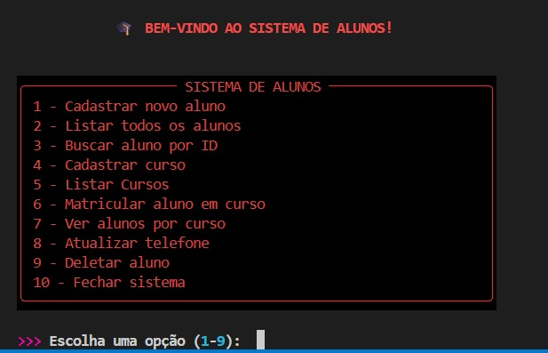

 

### Cadastro de aluno

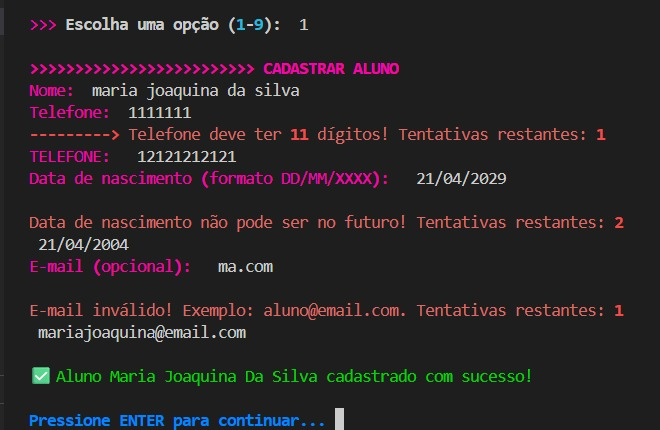

 

### Lista de alunos

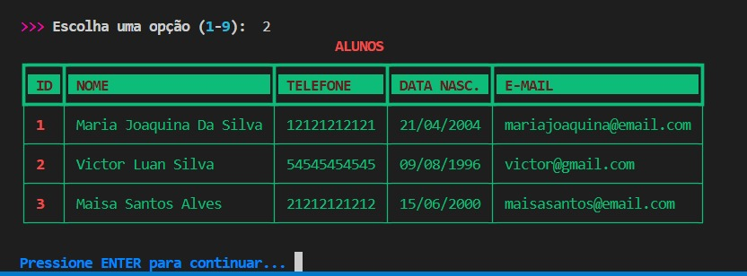

### Buscar aluno

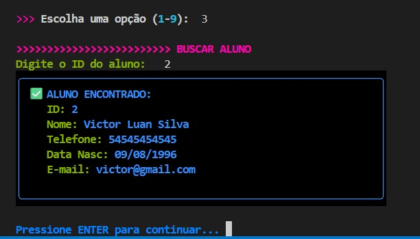

 

### Cadastro de cursos

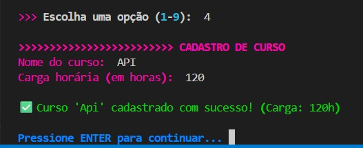

 

### Lista de cursos

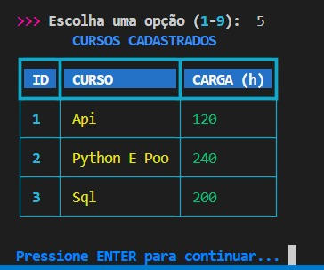

 

### Matrícula parte 1

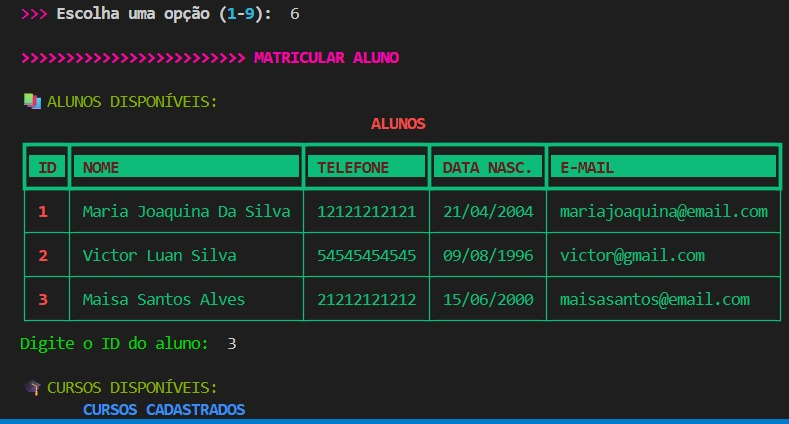

 

### Matrícula parte 2

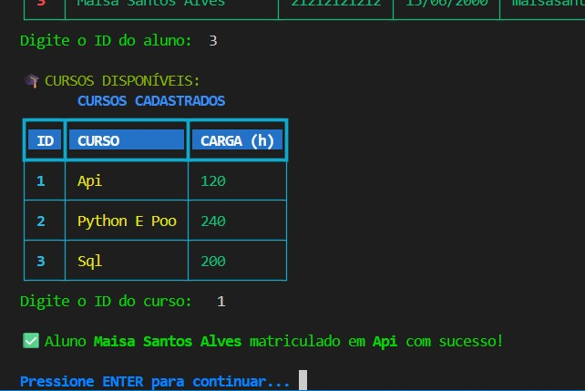

 

### Ver alunos por cursos

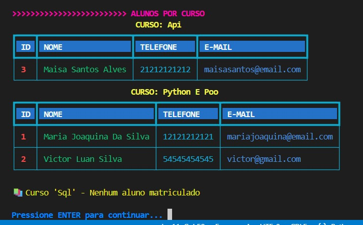

 

### Atualizar telefone

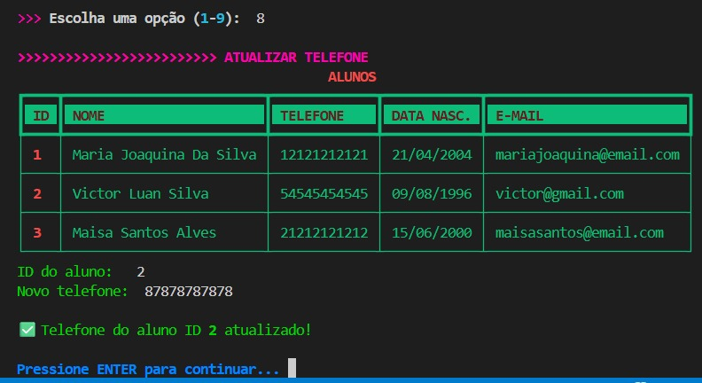

 

### Deletar aluno 

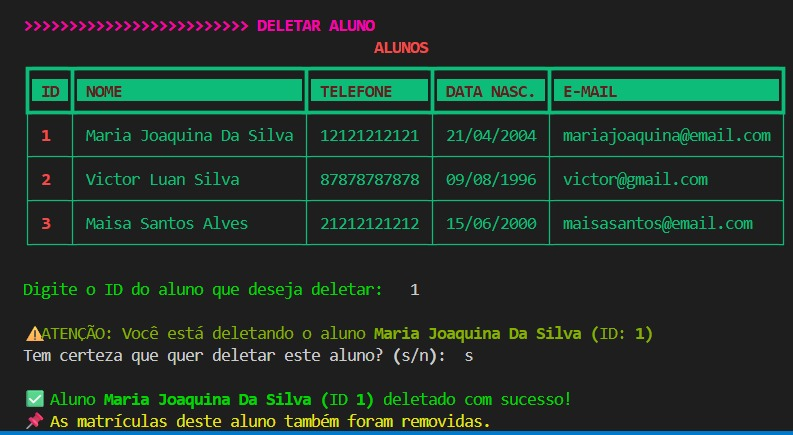

 

|⚠️ Vale lembrar que algumas funções como leiaint() que lê numeros inteiros e leia_telefone() que que valida 11 digitos, foram reutilizadas de um outro sistema que criei inicialmente o *SISTEMA DE BIBLIOTECA COM POO*  que é um repositório aqui do meu perfil. Código documentado e explicativo para me ajudar a codar com mais organização e para expor meus estudos a quem precisar.

